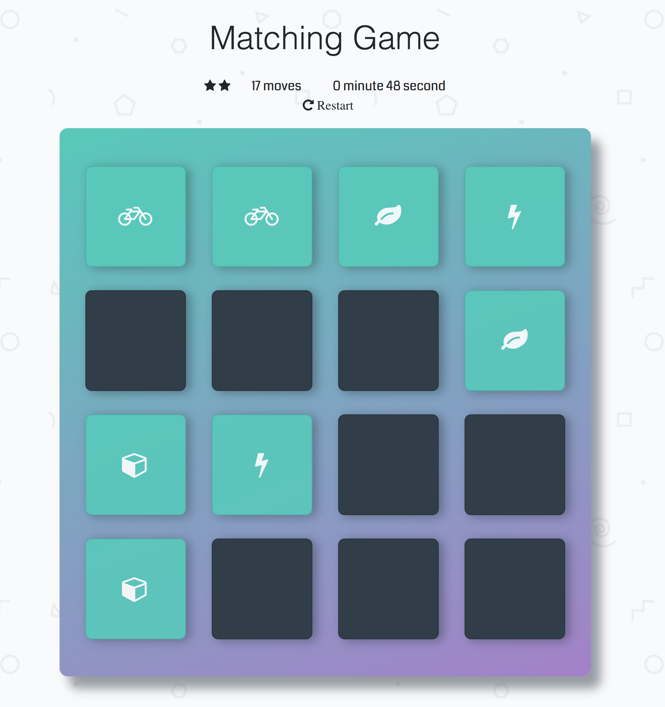

# Memory Game Project

## Table of Contents

* [About](#About)
* [Instruction for Installation](#Installtion)
* [How to Play](#How)
* [How the game working](#How)
* [How the game built](#How)

## About

The project is built based on the requirement in Fend Udacity course. It is a memory game which players try to find the matching cards. The game runs upon the rules that two cards match and stay open, otherwise they will close. After finding out all the matching pair of cards, the player will see an popup giving congratulation message, the rating stars based on the number of moves.

## Installation

1. Clone the project to your computer
2. Run index.html in your browser
3. Play the game

## How to Play

* Click on the cards to unveil them
* Try to remember the pair of the same card in different position to unveil them. When a pair of the same card is unveil, they will stay opened, otherwise, they will disappear.
* Try to match all the cards with less moves and time. 
* If all the cards are opened. Congratulation! You win the game.

## How the game working

The goal is to match all the cards together with less moves and less time. The game will display the rating star, the number of moves, and the timer.

* Start by clicking on two cards. If they match, they will stay opened, otherwise they will stay closed, try again until all cards stay opened. 

* While playing, player can reset the game by pressing restart button

* When all the cards matched, a popup window will appear to show the statistics of the game such as the rating stars, the number of moves and the time of the game. Player can continue to play another game by pressing the "play again" button. 

## How the game built

HTML, CSS, and Vanilla Javacript are used to build the game. The initial design of the game is offered by the instructors of the course. I used Vanilla JS to manipulate the DOM. I altered some part in HTML. In addition, I added some effects in CSS and make the game reponsive with various screen size.

* Create function to count the moves based on number of click on the card
* Create timer function to record the playing time
* Create rating function to rate the game based on the number of moves
* Create the deck to contain the shuffled cards
* Create function to check to the cards whether they are matched or unmatched
* Create function to open the matched cards and close the unmatched cards
* Create pop-up modal to appear to congratulate the winner and give some statistics of the game such as the number of moves, the playing time and the rating. 

